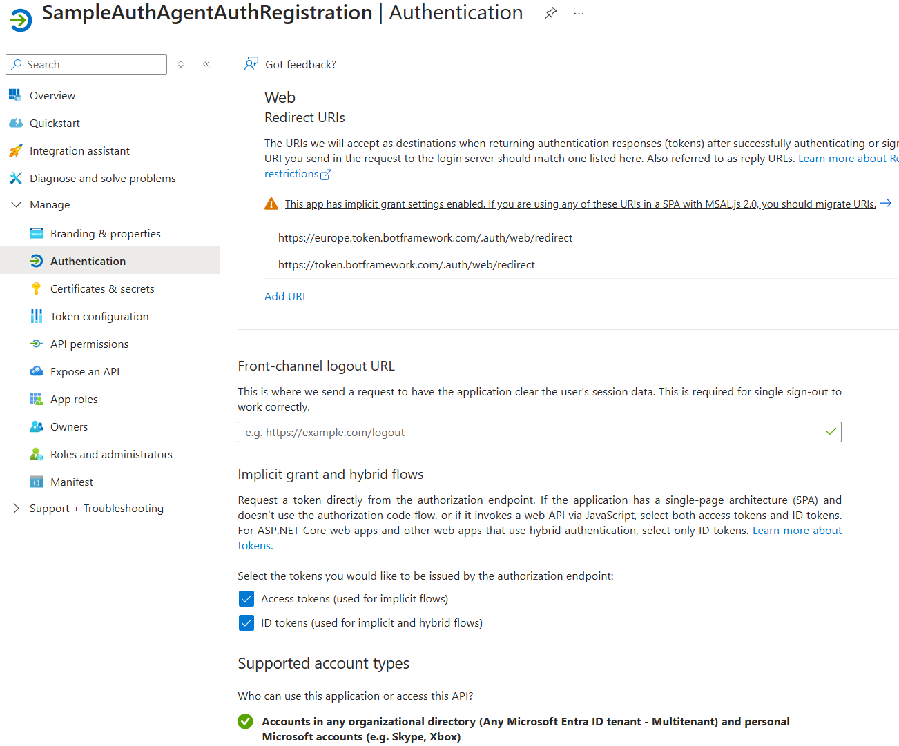
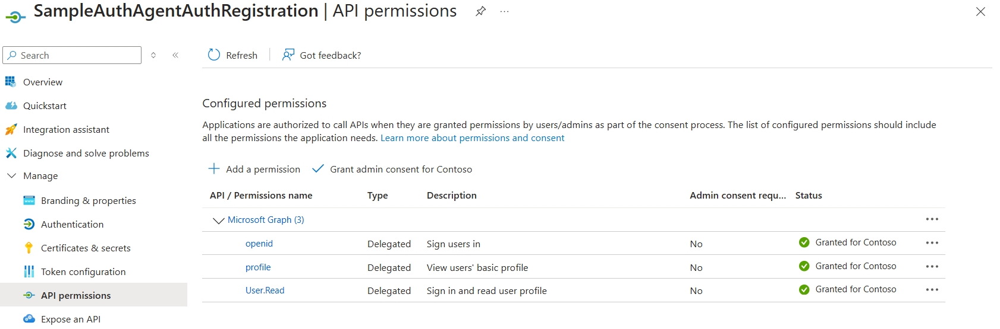
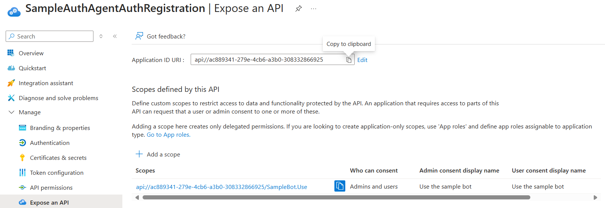
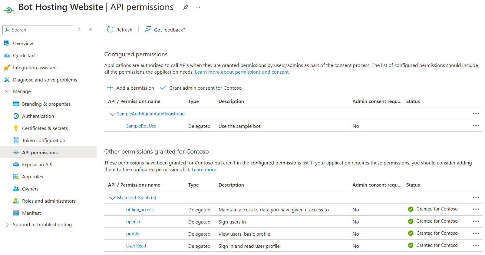
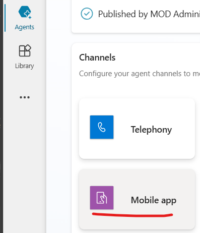
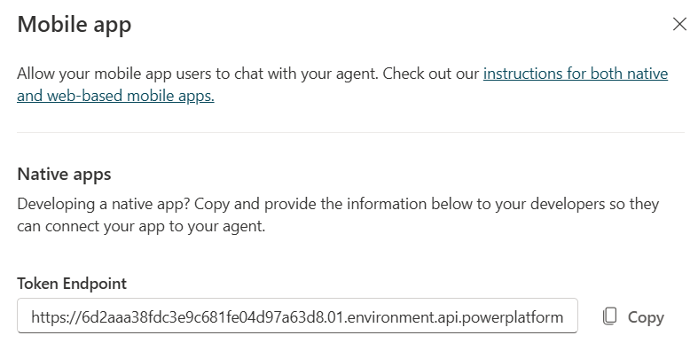

## Background


This website demonstrates the [Bot Framework Web Chat component](https://github.com/microsoft/BotFramework-WebChat) connected to a Copilot Studio Agent using Entra authentication without requiring an authentication pop up. This may be helpful in scenarios where popups aren't allowed

It is based on the [Configure single sign-on with Microsoft Entra ID](https://learn.microsoft.com/en-us/microsoft-copilot-studio/configure-sso) article from Microsoft Learn. Note that this article references the <a href="https://github.com/microsoft/CopilotStudioSamples/tree/legacy/BuildYourOwnCanvasSamples">BuildYourOwnCanvasSamples</a> sample from <a href="https://github.com/microsoft/CopilotStudioSamples">CopilotStudioSamples</a> on Github.

## Dependencies and Setup Guide##
Read through the article <a href="https://learn.microsoft.com/en-us/microsoft-copilot-studio/configure-sso">Configure single sign-on with Microsoft Entra ID</a> before setting this up. Making it work in your environment requires the following steps (more detail is in the article)

### Step 1: Create Custom Agent in Copilot Studio
Create the agent in Copilot Studio. Instructions on configuring security will come later.

### Step 2: Create an app registration in Microsoft Entra ID for your Copilot Studio Agent
This is referred to as *authentication app registration* In the article. Key points to ensure you cover:
#### Authentication Tab

1. Redirect URL 1: https://europe.token.botframework.com/.auth/web/redirect
2. Redirect URL 2: https://token.botframework.com/.auth/web/redirect
3. Implicit and Hybrid Flows: both *Access Tokens* and *ID tokens*
4. Supported Account Types: Accounts in any organizational directory

See below image for an example:



#### API Permissions Tab
Give the API the following permissions:
- openid
- profile
- User.Read

See below image for an example:



#### Expose an API Tab

1. Generate an Application ID URI
2. Create a scope (effectively a security permission) for using your Agent

See below image for an example: <br />


#### Owners Tab
Make yourself an Owner of this app. This is needed to enable you to easily assign this permission in Step 4.
### Step 3: Connect the App Registration to Copilot Agent

The next step is to connect the app registration we just created to the Agent from Step 1. This requires the following actions:

1. Open the Agent and navigate to Settings --> Security --> Authentication
2. Change authentication option to *custom*
3. If the redirect Url isn't registered in the app you created in Step 2, add it
4. Enter the Client ID and Secret (create new secret if necessary) from the App you created in Step 2
5. Paste the __full URL __ of the API you created in Step 2 --> Expose an API Tab. It will be in format (api://GUID/Permission)
6. Enter profile openid in the scopes section
7. Save

### Step 4: Create an app registration in Microsoft Entra ID for this web app (the canvas)
This website is the custom canvas. It will need its own app registration to be able to log in and access the Agent on behalf of the users. Configure each of the tabs accordingly

#### Authentication Tab
- Redirect URL for your development website root (e.g. https://localhost:7287)
- Redirect URL for your development website webchat page (e.g. https://localhost:7287/Webchat)
- Redirect URL for your development website oidc endpoint (e.g. https://localhost:7287/signin-oidc)
- Implicit and Hybrid Flows: both *Access Tokens* and *ID tokens*
- Supported Account Types: Accounts in any organizational directory

#### API Permissions Tab
- Configured Permissions: add the the API you created in Step 2 --> Expose an API Tab. It will be in format (api://GUID/Permission)
- Other Permissions: Microsoft Graph -> offline_access
- Other Permissions: Microsoft Graph -> openid
- Other Permissions: Microsoft Graph -> profile
- Other Permissions: Microsoft Graph -> User.Read
- Grant Admin Consent for all items


See below image for an example:


### Step 5: Connect this website to the App Registration you created in Step 4
This website is the custom canvas. It will need its own app registration to be able to log in and access the Agent on behalf of the users. Configure each of the tabs accordingly

#### Edit appsettings.json
Change the following values under AzureAd to your tenant and the App Registration you created in Step 4
- Domain
- TenantId
- Client ID

#### Search and Replace
Change the following values under DownstreamApi to the App Registration values you created in Step 2
- Base Url - __to the Application ID URI from Step 2 --> Expose an API__
- Scopes - __to the custom scope you created in Step 2 --> Expose an API e.g. SampleBot.CallBot__
- Scopes (default) - __to a default value for the custom scope you created in Step 2 --> Expose an API e.g. SampleBot.CallBot/.default__
- Client ID

Search and replace all instances of api://ac889341-279e-4cb6-a3b0-308332866925/SampleBot.Use to the api you created in Step 2 --> Expose an API. Note that AuthorizeForScopes attribute is used to trigger the authentication when users access the website. Affected files are:

- Index.cshtml.cs
- WebChat.cshtml *inside javascript*
- WebChat.cshtml.cs

#### Edit WebChat.cshtml JavaScript

Next, edit the following values in web WebChat.cshtml
var theURL = ''
Replace this with the Token Endpoint value from your Copilot Studio Agent. Top find it, open your Agent and navigate to --> Channels --> Mobile.
    


Then copy the Token Endpoint value from below and paste it as described above.



   
Next, find this Javascript code block inside the file, replace the client ID and Tenant ID values with app registration setting from Step 4:

``` 
auth: {
    clientId: 'CLIENT_ID_FROM_CUSTOM_WEBSITE',
    authority: 'https://login.microsoftonline.com/YOUR_TENANT_ID'
},
```

## Testing
The App should be ready for testing.

[Click here to test the chat widget](/Webchat)
